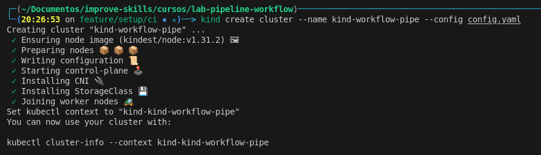
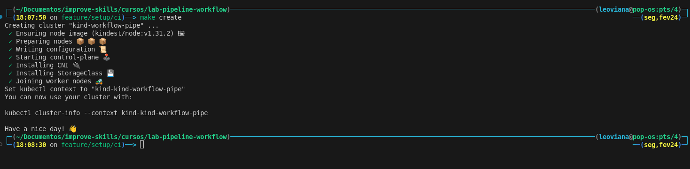
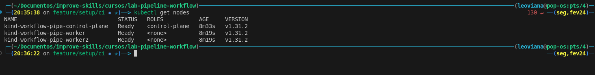
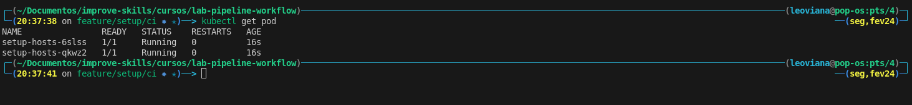

# Setup Cluster
- Levantar e configurar um cluster kubernetes local


## Cluster com multinode

- Limites de arquivos a serem abertos pelo linux: Aumentar um pouco esse limite
- Persistência de parâmetros do kernel

```bash
echo fs.inotify.max_user_instances=1280 | sudo tee -a /etc/sysctl.conf 
echo fs.inotify.max_user_watches=655360 | sudo tee -a /etc/sysctl.conf 
sudo sysctl -p
```

- Criando o cluster

1. Opção 1

```bash
kind create cluster --name kind-workflow-pipe --config config.yaml  
```

<p align="left">
  
</p>


2. Opção 2

```bash
make create
```

<p align="center">
  
</p>


- Checando o cluster

```bash
kubectl get nodes
```

<p align="center">
  
</p>


## Adicionando DNS aos nodes do cluster

- Através das labels do docker

```bash
docker ps --filter="label=io.x-k8s.kind.role=worker" -q  
```

- Rodando comandos em todos os containers através de um `for`

```bash
for container in $(docker ps --filter="label=io.x-k8s.kind.role=worker" -q); do echo $container; done 
```

- Add DNS nos containers 

```bash
for container in $(docker ps --filter="label=io.x-k8s.kind.role=worker" -q); do docker exec $container bash -c "echo '172.18.0.50 argocd.localhost.com jenkins.localhost.com gitea.localhost.com sonarqube.localhost.com harbor.localhost.com' >> /etc/hosts"; done 
```

- Utilizando um `Daemonset` para inserir DNS host de forma mais automatizada.
    - [Daemonset](./manifests/setup-hosts.yaml)

- Aplicando o manifesto `setup-hosts.yaml` ao cluster

```bash
kubectl apply -f manifests/setup-hosts.yaml
```

- Checado os pod do `setup-host`

```bash
kubectl get pod
```
<p align="center">
  
</p>

## Parar e Iniciar o cluster

- Parando o cluster 
```bash
docker stop $(docker ps -q) 
```

- Startando o Cluster
```bash
docker start kind-workflow-pipe-control-plane kind-workflow-pipe-worker kind-workflow-pipe-worker2
```

