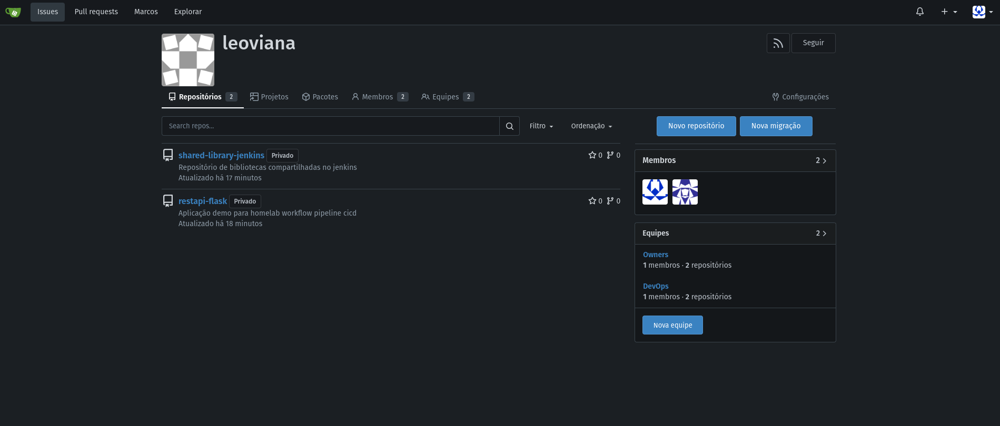

## Setup SCM

## Roadmap

- [x] Criar uma nova organização
- [x] Criar 1 repositório para a aplicação demo `restapi-flask` dentro da nova organização
- [x] Criar 1 repositório para as bibliotecas que serão utilizadas pelo jenkins `shared-library-jenkins` dentro da nova organização
- [x] Criar uma equipe `DevOps` dentro da nova organização
- [x] Criar um service user `jenkins` (Conta de serviço para ser utilizada no jenkins) e adicionar a equipe criada
- [x] Criar uma chave ssh para o usuário jenkins e adicionar a chave pública na sua conta dentro do gitea
- [x] Expor a porta SSH do Gitea pelo ingress
- [x] Testar o service user (git clone)

  

