# Setup Cluster Tools

- Instalação de ferramentas no Cluster

## Metallb

- Identificar a rede utilizada pelo kind

```bash
docker network ls | grep kind
docker inspect <network>
docker inspect kind | jq -r '.[].IPAM.Config[0].Subnet'
```

- Instalação do Metallb

```bash
kubectl apply -f https://raw.githubusercontent.com/metallb/metallb/v0.14.3/config/manifests/metallb-native.yaml
kubectl wait --namespace metallb-system \
```
- Este comando irá instalar o MetalLB em seu cluster, no namespace metallb-system.

<p align="center">
  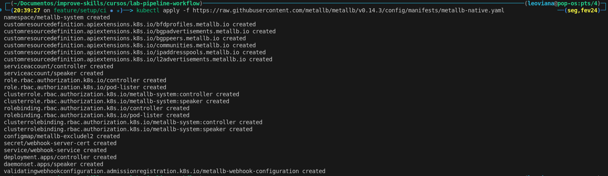
</p>


- O MetalLB permanecerá inativo até ser configurado. Para configurar o MetalLB, você precisa definir os IPs que serão atribuídos aos serviços do Load Balancer. Aqui está um exemplo de como fazer isso:
- Obs: Os ips definidos tem que está dentro da faixa da rede do kind identificado no passo acima.

- Layer 2 Configuration

```yaml
apiVersion: metallb.io/v1beta1
kind: IPAddressPool
metadata:
  name: homelab-pool
  namespace: metallb-system
spec:
  addresses:
  - 172.18.0.50-172.18.0.70
---
apiVersion: metallb.io/v1beta1
kind: L2Advertisement
metadata:
  name: home-advertisement
  namespace: metallb-system
spec:
  ipAddressPools:
  - homelab-pool
```

```bash
kubectl apply -f manifests/metallb-pool.yaml
```

<p align="center">
  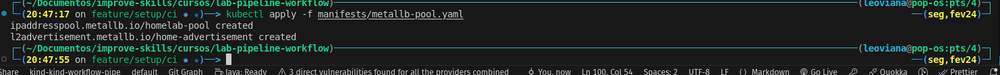
</p>


- [Documentation - Inatallation by manifest](https://metallb.io/installation/#installation-by-manifest)
- [Documentation - Configuration](https://metallb.io/configuration/#layer-2-configuration)

## Ingress Nginx

1. Add repo `ingress`

```bash
helm repo add ingress-nginx https://kubernetes.github.io/ingress-nginx
```
<p align="center">
  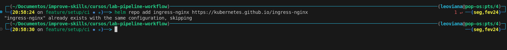
</p>

2. Atualizar repo `ìngress`

```bash
helm repo update
```

<p align="center">
  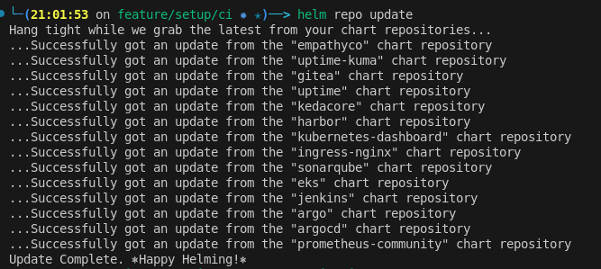
</p>


3. Localizar o repo `ìngress`

```bash
helm search repo nginx 
``` 

<p align="center">
  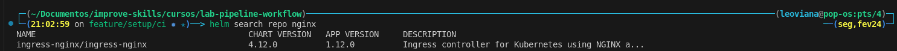
</p>

4. Checando o template do repo `ìngress` - caso queira dar uma olhada

```bash
helm template nginx ingress-nginx/ingress-nginx >test
```

5. Atualizando e instalando ingress controller

```bash
helm upgrade --install --namespace ingress-nginx --create-namespace -f helm-tools/ingress-nginx/values.yaml ingress-nginx ingress-nginx/ingress-nginx
```

<p align="center">
  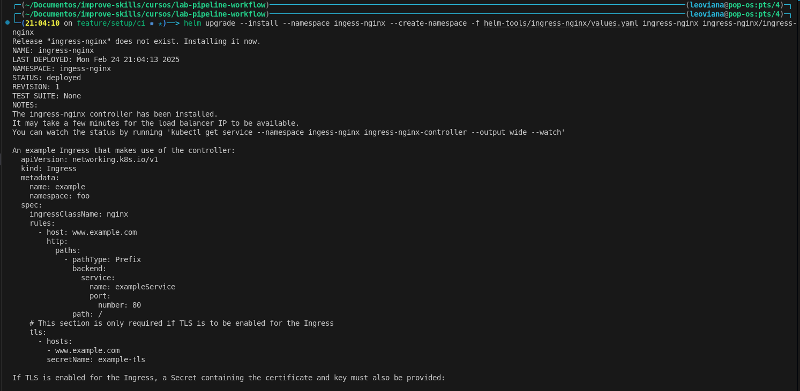
</p>

- [Values utilizado](../helm-tools/ingress-nginx/values.yaml)

6. Deletando um Chart

```bash
helm delete ingress-nginx -n ingess-nginx 
```

## Jenkins

- [Repositório](https://github.com/jenkinsci/helm-charts)
- [Velues utilizado](../helm-tools/jenkins/values.yaml)


- Get Password

```bash
kubectl get secret -n jenkins jenkins -ojson | jq -r '.data."jenkins-admin-password"' | base64 -d
```

- Jenkins

<p align="center">
  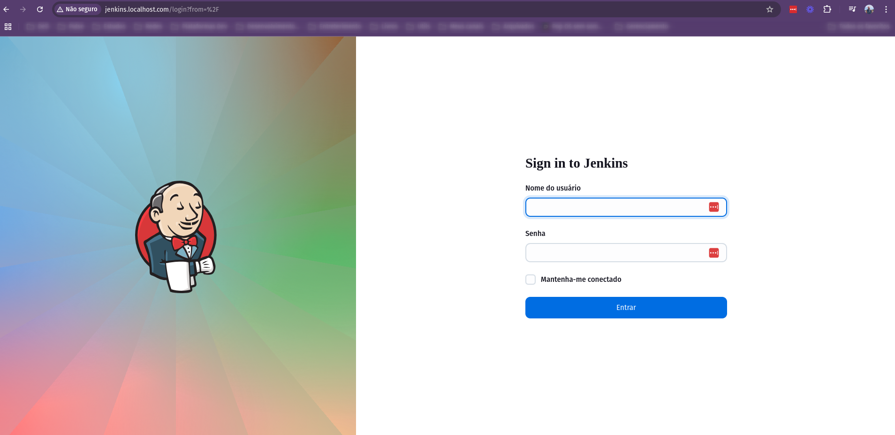
</p>

## Gitea

- [Repositório](https://gitea.com/gitea/helm-chart/src/tag/v10.5.0/)
- [Values utilizado](../helm-tools/gitea/values.yaml)

- Expondo porta SSH do Gitea pelo Ingress
- O NGINX consegue expôr tanto serviços L4 quanto L7. Para isso vamos configurar o values do Chart:

```bash
tcp:
  22: "gitea/gitea-ssh:22"
```

- Com isso, o Service do NGINX vai abrir a porta 22, e qualquer requisição ali, será enviado para o Service gitea-ssh na namespace gitea.

- Gitea

<p align="center">
  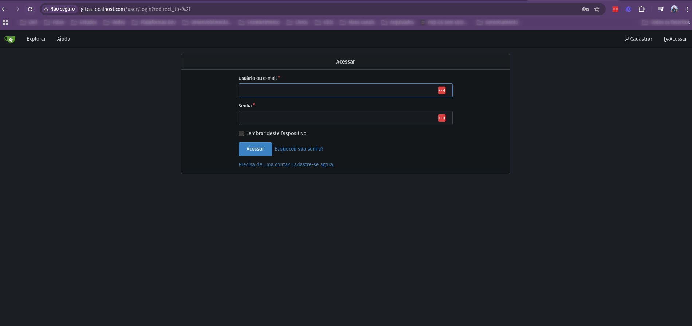
</p>

## Harbor

- [Repositório](https://github.com/goharbor/harbor-helm/tree/v1.16.2)
- [Values utilizado](../helm-tools/harbor/values.yaml)

- Harbor

<p align="center">
  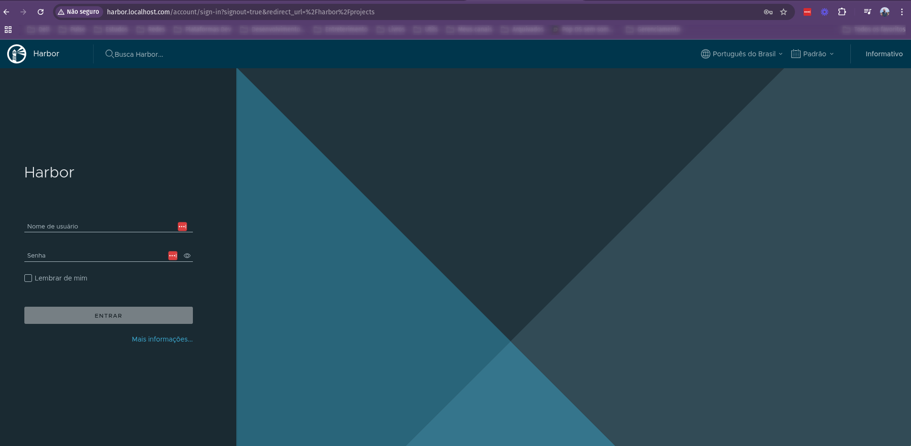
</p>

## Sonarqube
- [Repositório](https://github.com/SonarSource/helm-chart-sonarqube/tree/sonarqube-10.8.1-sonarqube-dce-10.8.1/charts/sonarqube)
- [Values utilizado](../helm-tools/sonarqube/values.yaml)

- Sonarqube

<p align="center">
  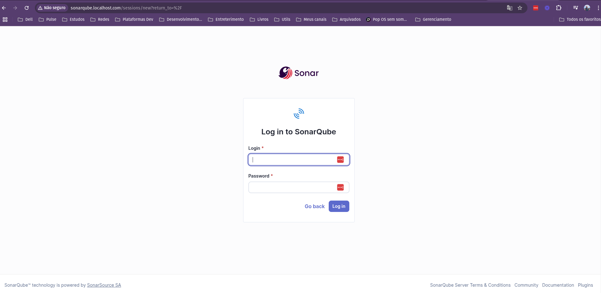
</p>

- Sonarscanner

```bash
docker run \
    --rm \
    -e SONAR_HOST_URL="http://sonarqube.localhost.com"  \
    -e SONAR_TOKEN="sqa_dff6aec5e57e94f8c876015f0da2b0a891f819b9" \
    -e SONAR_SCANNER_OPTS="-Dsonar.projectKey=test" \
    --network kind \
    --add-host sonarqube.localhost.com:172.18.0.50 \
    -v $(pwd):/usr/src \
    sonarsource/sonar-scanner-cli
```

## Argocd
- [Repositório](https://github.com/argoproj/argo-helm/tree/argo-cd-7.8.2
- [Values utilizado](../helm-tools/argocd/values.yaml)

- Argo CD

<p align="center">
  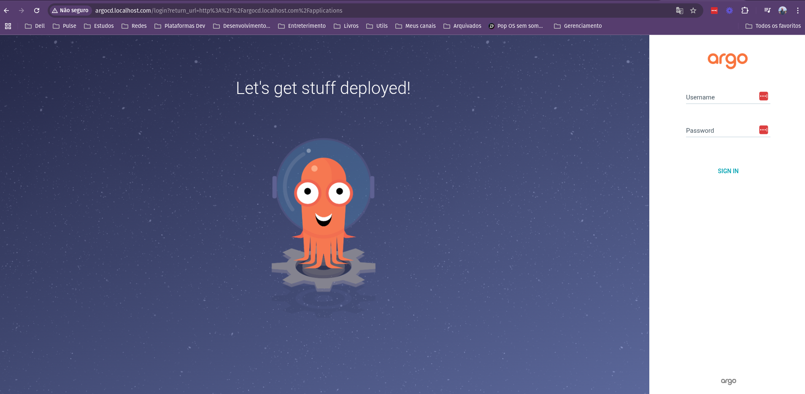
</p>

## Uptime Kuma

- Uptime Kuma - Status Page

<p align="center">
  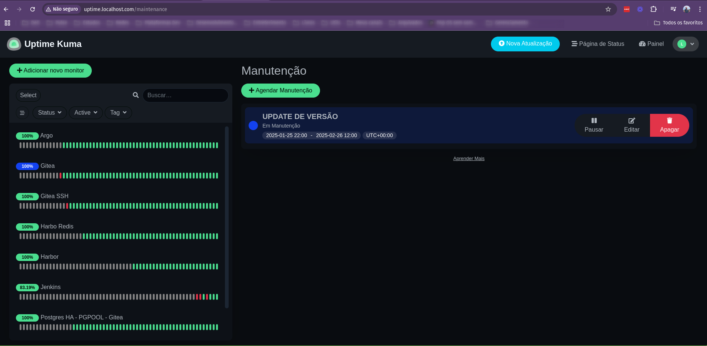
</p>


## Image Pull Secret Patcher
- [Repositório](https://artifacthub.io/packages/helm/empathyco/imagepullsecret-patcher)
- [Values utilizado](../helm-tools/imagepullsecret-patcher/)

## Kind
- Importando imagem para o cluster (Teste)

```bash
kind load docker-image restapi-flask:latest --name kind-workflow-pipe
```

## Kaniko

- Authentication

```bash
echo -n "user_harbor:passwd_harbor" | base64
```

- Arquivo de configuração para autenticar no Harbor `config.json`

```json
{
    "auths": {
            "harbor.localhost.com": {
                    "auth": "YWRtaW46SGFyYm9yMTIzNDU="
            }
    }
}
```

```bash
docker run --entrypoint "" \
  --volume $(pwd):/app \
  --volume $(pwd)/config.json:/kaniko/.docker/config.json \
  --workdir /app \
  --network kind \
  --add-host harbor.localhost.com:172.18.0.50 \
  -it gcr.io/kaniko-project/executor:debug sh
```

```sh
/kaniko/executor --insecure --context $(pwd) --destination harbor.localhost.com/viana/demo:0.0.1 
```


```bash
/kaniko/executor \
	--destination harbor.localhost.com/viana/demo:0.1 \
	--insecure \
	--context $(pwd)
```


## Helmfile

- Installation:

  - [Download Helmfile](https://github.com/helmfile/helmfile/releases)

- Descompactando o binário

```bash
tar xvzf helmfile_0.171.0_linux_amd64.tar.gz 
```

- Instalando

```bash
./helmfile 
```

- Check da versão

```bash
./helmfile version
```

- MOvendo o binário para o diretório `bin`

```bash
sudo mv -f helmfile /usr/local/bin 
```

- Checando a localização

```bash
sudo mv -f helmfile /usr/local/bin 
```

- Check versão

```bash
helmfile version   
```

- Instalação dos plugins

```bash
helm plugin add https://github.com/databus23/helm-diff
helm plugin install https://github.com/jkroepke/helm-secrets --version v4.2.2
helm plugin install https://github.com/aslafy-z/helm-git --version 0.14.3
$ helm plugin install https://github.com/hypnoglow/helm-s3.git --version 0.14.0
```

- Uma outra opção : https://gist.github.com/genedy2017/142861e20a7c88b3ac7a78c86e09a5da